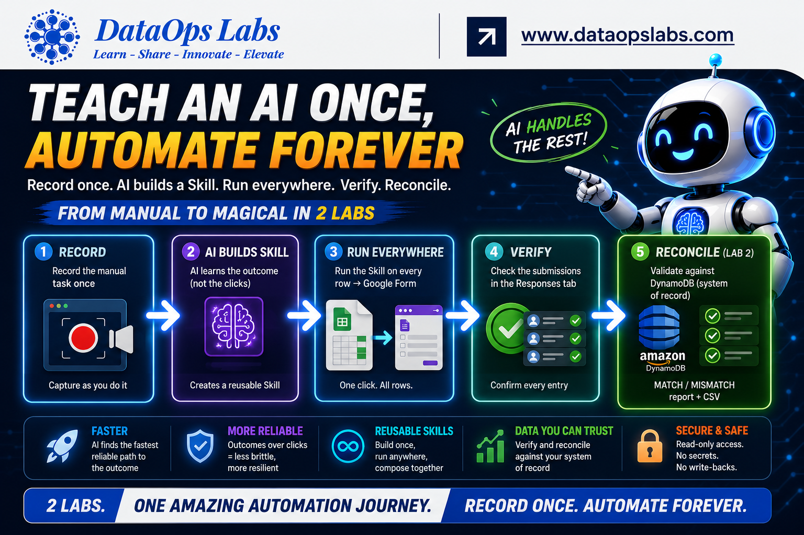
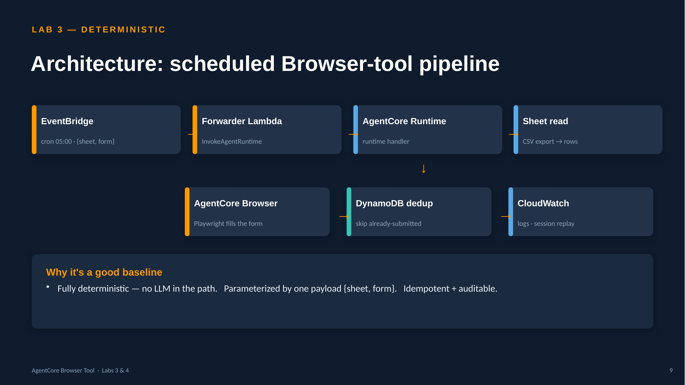
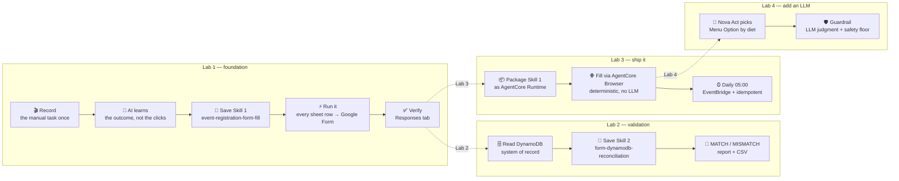

# Teach an AI Once, Automate Forever
### Turning a screen recording into reusable Skills — with Cowork (Claude desktop)

> **The big idea:** Record yourself doing a boring, repetitive task *one time*. The AI watches,
> figures out the **outcome** of each action (not the mouse clicks), and writes a reusable **Skill**.
> Run that Skill across every row, then chain a **second** Skill that checks the results against a
> database and hands back a clean report — all without writing the automation by hand.

<p align="center">
  
</p>


## 📺 Watch the walkthroughs

> Click a thumbnail to play on YouTube. (GitHub can't embed a live YouTube player inside a README,
> so these are clickable video thumbnails.)

<table>
  <tr>
    <td align="center" width="50%">
      <a href="https://youtu.be/CoHWju-5ork">
        <br/>
        ▶️ <b>Lab 1 — Record → Skill → fill the form</b>
      </a>
    </td>
    <td align="center" width="50%">
      <a href="https://youtu.be/HH-G-5ZjqzE">
        <br/>
        ▶️ <b>Lab 2 — Add a system of record (DynamoDB)</b>
      </a>
    </td>
  </tr>
</table>

---

## What's in this repo

This repo is a hands-on demo in **three labs** that build on each other. Start with Lab 1.

| Lab | Title | What you learn | Skills / artifacts | Video |
|-----|-------|----------------|--------------------|-------|
| **[Lab 1](./lab1/README.md)** | Record → Skill → fill the form | Turn a recording into a Skill and bulk-submit every spreadsheet row into a Google Form | `event-registration-form-fill` | [▶️ Watch](https://youtu.be/CoHWju-5ork) |
| **[Lab 2](./lab2/README.md)** | Add a system of record | Chain a second Skill that validates the responses and reconciles them against a DynamoDB table | `event-registration-form-fill` + `form-dynamodb-reconciliation` | [▶️ Watch](https://youtu.be/HH-G-5ZjqzE) |
| **[Lab 3](./lab3/README.md)** | Ship it as a runnable, scheduled stack | Deploy Skill 1 as a fully-deterministic AgentCore Runtime job that fills the form with the **AgentCore Browser Tool**, parameterized by one `{sheet, form}` payload, made idempotent with DynamoDB, and triggered daily by EventBridge | AgentCore Runtime + Browser, forwarder Lambda, EventBridge schedule, DynamoDB dedup | — |
| **[Lab 4](./lab4/README.md)** | Add an LLM where it's needed (Nova Act) | The form gains a **Menu Option** with no sheet column — the dish must be *reasoned* from each attendee's diet. Keep deterministic Playwright for the known fields; add **Amazon Nova Act** to pick the menu, with a deterministic safety guardrail | Hybrid AgentCore Runtime: Playwright + Nova Act + dietary guardrail | — |

---

## Architecture at a glance

**Lab 3 — deterministic AgentCore Browser pipeline**



**Lab 4 — hybrid: deterministic Playwright + Nova Act (LLM) + Strands agent**


> 📊 A full **45-minute session deck** for Labs 3 & 4:
> [`lab4/AgentCore-Browser-Tool-Session.pptx`](lab4/AgentCore-Browser-Tool-Session.pptx)  ·  presenter walkthrough in [`lab4/workflow_info.md`](lab4/workflow_info.md).

---

## The journey



---

## Why this matters

Most business automation dies on the vine because writing it by hand is slow and brittle. This demo
flips the model: **you demonstrate the task once**, and the AI captures it as a durable, re-runnable
Skill. The key trick is that the AI doesn't replay your clicks — it finds the fastest reliable path to
the same **outcome** (here, a direct `formResponse` HTTP POST instead of typing into the UI), so the
automation is faster *and* less fragile than a macro recording.

Skills also **compose**: Lab 2's reconciliation Skill runs on top of Lab 1's output, so a small library
of Skills becomes an end-to-end pipeline.

And Skills **graduate to production**: **Lab 3** takes Skill 1 from an interactive Cowork run to a
deployed, scheduled AWS stack — a fully deterministic AgentCore Runtime job that fills the form through
the **AgentCore Browser Tool** (no LLM in the loop, no API fallback), parameterized by a single
`{sheet, form}` payload, made idempotent with DynamoDB, and fired every morning by EventBridge.

---

## Quick start

```bash
# Lab 1 — the foundation: recording → Skill → filled Google Form
open lab1/README.md

# Lab 2 — add a DynamoDB system-of-record check on top
open lab2/README.md

# Lab 3 — ship Skill 1 as a scheduled AgentCore stack
open lab3/README.md
open ImplementationPlan.md                       # full workshop deploy walkthrough
cd lab3 && make install && make browser-test    # real AgentCore Browser smoke test

# Peek at the artifacts each lab produced
column -s, -t < lab1/submissions/event_registration_entries.csv | less
cd lab2/reconciliation && python3 reconcile.py    # form_responses.json + ddb_items.json → CSV
```

**Prerequisites:** Cowork (Claude desktop) with **Claude in Chrome**; for Lab 2, the **AWS API MCP**
and short-lived, **read-only** AWS credentials; for Lab 3, an **AgentCore-enabled AWS account**
(AgentCore Runtime + Browser), Docker, and python3.12.

---

## Repository layout

```
claude-recording-skill-demo/
├── README.md            ← you are here (overview of all four labs)
├── ImplementationPlan.md ← Lab 3 workshop deploy guide (step-by-step)
├── assets/              ← put your automation image(s) here
├── lab1/                ← Lab 1: record → Skill → fill the Google Form
│   ├── README.md
│   ├── skills/event-registration-form-fill/SKILL.md
│   └── submissions/     ← source rows, submission engine, results
├── lab2/                ← Lab 2: validate + reconcile against DynamoDB
│   ├── README.md
│   ├── skills/
│   │   ├── event-registration-form-fill/SKILL.md
│   │   └── form-dynamodb-reconciliation/SKILL.md
│   └── reconciliation/  ← reconcile.py, input JSON, results CSV
├── lab3/                ← Lab 3: ship Skill 1 as a scheduled AgentCore stack
│   ├── README.md        ← flow, determinism analysis, deploy, ops
│   ├── runtime_handler.py · params.py · sheet_reader.py
│   ├── form_filler.py   ← AgentCore Browser + Playwright (deterministic, no LLM)
│   ├── idempotency.py   ← DynamoDB dedup (no double-submits)
│   ├── agent.py         ← optional ADK v2 graph form (not deployed)
│   ├── Dockerfile · Makefile · requirements.txt
│   ├── events/          ← payload schema + example (the {sheet, form} seam)
│   └── deploy/          ← forwarder Lambda, schedule, dedup table, IAM, ship guide
└── lab4/                ← Lab 4: hybrid — deterministic + Nova Act (LLM) + Strands
    ├── README.md        ← the hybrid split, guardrail, run/ship
    ├── app.py           ← unified AgentCore entrypoint (Strands agent + deterministic modes)
    ├── menu_picker.py   ← Nova Act picks Food Option + dietary guardrail
    ├── form_filler.py   ← Playwright for known fields, Nova Act for the judgment field
    ├── workflow_info.md ← detailed presenter walkthrough
    ├── AgentCore-Browser-Tool-Session.pptx  ← 45-min session deck (Labs 3 & 4)
    ├── assets/          ← architecture image
    └── (Lab 3 stack, renamed lab4_*)
```

---

## Safety notes

- All emails and phone numbers in this repo are **dummy test data**.
- **No AWS keys, session tokens, or other secrets** are committed — credentials live only inside the
  Cowork session and are never printed, logged, or stored here.
- Any cloud access (Lab 2's DynamoDB) is strictly **read-only**; the reconciliation never writes back.
- Side-effecting steps (submitting the form) always confirm scope first, skip already-submitted rows,
  and send one test row before the rest.
