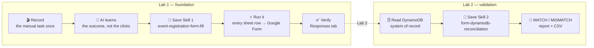

# Teach an AI Once, Automate Forever
### Turning a screen recording into reusable Skills — with Cowork (Claude desktop)

> **The big idea:** Record yourself doing a boring, repetitive task *one time*. The AI watches,
> figures out the **outcome** of each action (not the mouse clicks), and writes a reusable **Skill**.
> Run that Skill across every row, then chain a **second** Skill that checks the results against a
> database and hands back a clean report — all without writing the automation by hand.

<p align="center">
  
</p>

---

## What's in this repo

This repo is a hands-on demo in **two labs** that build on each other. Start with Lab 1.

| Lab | Title | What you learn | Skills produced |
|-----|-------|----------------|-----------------|
| **[Lab 1](./lab1/README.md)** | Record → Skill → fill the form | Turn a recording into a Skill and bulk-submit every spreadsheet row into a Google Form | `event-registration-form-fill` |
| **[Lab 2](./lab2/README.md)** | Add a system of record | Chain a second Skill that validates the responses and reconciles them against a DynamoDB table | `event-registration-form-fill` + `form-dynamodb-reconciliation` |

---

## The journey



---

## Why this matters

Most business automation dies on the vine because writing it by hand is slow and brittle. This demo
flips the model: **you demonstrate the task once**, and the AI captures it as a durable, re-runnable
Skill. The key trick is that the AI doesn't replay your clicks — it finds the fastest reliable path to
the same **outcome** (here, a direct `formResponse` HTTP POST instead of typing into the UI), so the
automation is faster *and* less fragile than a macro recording.

Skills also **compose**: Lab 2's reconciliation Skill runs on top of Lab 1's output, so a small library
of Skills becomes an end-to-end pipeline.

---

## Quick start

```bash
# Lab 1 — the foundation: recording → Skill → filled Google Form
open lab1/README.md

# Lab 2 — add a DynamoDB system-of-record check on top
open lab2/README.md

# Peek at the artifacts each lab produced
column -s, -t < lab1/submissions/event_registration_entries.csv | less
cd lab2/reconciliation && python3 reconcile.py    # form_responses.json + ddb_items.json → CSV
```

**Prerequisites:** Cowork (Claude desktop) with **Claude in Chrome**; for Lab 2, the **AWS API MCP**
and short-lived, **read-only** AWS credentials.

---

## Repository layout

```
claude-recording-skill-demo/
├── README.md            ← you are here (overview of both labs)
├── assets/              ← put your automation image(s) here
├── lab1/                ← Lab 1: record → Skill → fill the Google Form
│   ├── README.md
│   ├── skills/event-registration-form-fill/SKILL.md
│   └── submissions/     ← source rows, submission engine, results
└── lab2/                ← Lab 2: validate + reconcile against DynamoDB
    ├── README.md
    ├── skills/
    │   ├── event-registration-form-fill/SKILL.md
    │   └── form-dynamodb-reconciliation/SKILL.md
    └── reconciliation/  ← reconcile.py, input JSON, results CSV
```

---

## Safety notes

- All emails and phone numbers in this repo are **dummy test data**.
- **No AWS keys, session tokens, or other secrets** are committed — credentials live only inside the
  Cowork session and are never printed, logged, or stored here.
- Any cloud access (Lab 2's DynamoDB) is strictly **read-only**; the reconciliation never writes back.
- Side-effecting steps (submitting the form) always confirm scope first, skip already-submitted rows,
  and send one test row before the rest.
