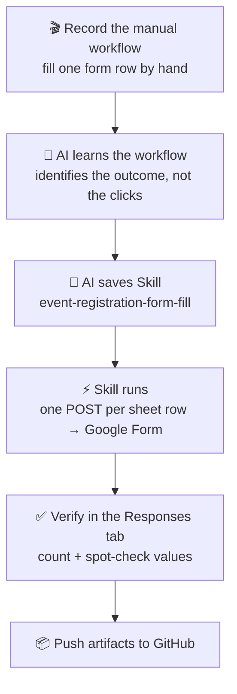

# Lab 1 — Teach an AI Once, Automate Forever
### From a screen recording → one reusable Skill → a fully-filled Google Form

> Part of a four-lab series — see the [repo overview](../README.md). Next: [Lab 2](../lab2/README.md) (reconcile), [Lab 3](../lab3/README.md) (ship on AgentCore), [Lab 4](../lab4/README.md) (add an LLM).

> **The one-line story:** We recorded ourselves filling an event-registration form *one time*.
> The AI watched, turned it into a reusable Skill, and then submitted **every row** of the
> spreadsheet into the Google Form — as real responses — without us clicking through the UI
> again.

This README is a **step-by-step story** you can follow to reproduce the exercise.
Each step lists exactly **what happened** and **which tools did the work**.

Lab 1 is the **foundation**. [Lab 2](../lab2/README.md) picks up from here and adds a second
Skill that validates the submitted responses against a DynamoDB system of record.

---

## What we built

One Cowork Skill:

1. **`event-registration-form-fill`** — reads rows from a Google Sheet and submits each one
   into a Google Form (as individual responses), using the fast programmatic path
   (`formResponse` HTTP POST) instead of clicking through the UI.

---

## End-to-end flow



---

## The story, step by step

### Step 1 — Record the manual task
We turned on screen recording and filled in the Event Registration **Google Form** by hand for
one or two people, copying values out of the **`event_registration_entries` Google Sheet**
(email, name, phone, food preference, T-shirt size, attendance time) and hitting **Submit**.
That recording became the *teaching example*.

- **Tools:** Desktop **screen recording** (computer-use recorder), Google Chrome, Google Forms, Google Sheets.

### Step 2 — The AI turns the recording into a Skill
Instead of replaying our mouse clicks, the AI identified the *outcome* of each action and wrote
a reusable Skill that submits a row via the Google Forms `formResponse` HTTP endpoint — far
faster and more reliable than UI automation. It discovered the form's field IDs from the form's
embedded config (`FB_PUBLIC_LOAD_DATA_`) and baked in the sheet→field mapping.

- **Tools:** **Claude in Chrome** (`navigate`, `javascript_tool` to read `FB_PUBLIC_LOAD_DATA_`),
  **Save Skill** (`save_skill`) → produced **`event-registration-form-fill`**.

### Step 3 — Run the Skill to fill the whole sheet
With the Skill saved, the AI read the sheet, confirmed which rows to submit (skipping any already
recorded during the demo to avoid duplicates), submitted **one test row first**, then the rest —
one POST per row, each value validated against the form's real option strings. Every submission
returned Google's success confirmation.

- **Tools:** **Claude in Chrome** (`javascript_tool` POST to `formResponse`), **Task list**
  (`TaskCreate` / `TaskUpdate`) for progress tracking.

### Step 4 — Verify
A POST 200 at the `.../formResponse` URL is Google's success signal, but we confirmed persistence
too: we opened the form's **Responses** tab and checked the count and a few names, and cross-checked
the food / size / time distributions against the source rows so a wrong mapping couldn't hide behind
a green count.

- **Tools:** **Claude in Chrome** (`navigate` to the Responses tab, `get_page_text`).

### Step 5 — Publish the artifacts
Finally we staged everything into this `lab1/` folder (dummy data only — no secrets) and copied it
into the local clone of this GitHub repo, ready to commit and push.

- **Tools:** **Workspace shell** (`bash`), **Git** (local), GitHub.

---

## Tools used — quick reference

| Category            | Tool                              | Used for |
|---------------------|-----------------------------------|----------|
| Recording           | Computer-use screen recorder      | Capturing the manual demo |
| Browser automation  | Claude in Chrome                  | Reading form config, submitting responses, verifying |
| Skill authoring     | `save_skill`                      | Saving the reusable Skill |
| Data sources        | Google Sheets, Google Forms       | Source data + submission target |
| Progress + delivery | Task list, Git                    | Tracking, publishing |

---

## Reproduce it yourself

**Prerequisites**
- Cowork (Claude desktop) with **Claude in Chrome** available.
- A Google Sheet of registrants and a Google Form with matching fields.

**Do this**
1. Record yourself filling the form once from the sheet.
2. Ask Cowork to turn the recording into a Skill → you get a form-fill Skill.
3. Ask it to run the Skill on the remaining rows (confirm which rows first).
4. Open the form's Responses tab and verify the count and a few values.
5. Commit the artifacts to your repo.

**Inspect the artifacts directly**
```bash
cd lab1/submissions
column -s, -t < event_registration_entries.csv | less   # the 25 source rows
cat submission_results.json                              # per-row submission status
```
`submit_row.js` is the exact browser-side engine that was used — it runs inside an authenticated
Chrome tab (via Claude in Chrome), not as a standalone Node script, because the POST relies on the
session's Google cookies.

---

## Results from our run

- **25** registrants in the sheet → **25** responses recorded in the Google Form, **all unique**
  (no duplicates).
- Distributions cross-checked against the source rows:
  - **Preferred Food:** Non-Vegetarian 9, Vegan 8, Gluten-Free 4, Vegetarian 4
  - **T-Shirt Size:** S 8, XS 6, M 5, XL 3, L 2, XXL 1
  - **Event Attendance Time:** 1:00 PM – 4:00 PM → 15, 8:00 AM – 12:00 PM → 10
- **0** validation failures; **0** duplicates.

---

## Safety notes

- All emails/phone numbers here are **dummy test data**.
- Submitting a form is side-effecting and hard to undo, so the Skill always **confirms which rows**
  first, **skips rows already submitted**, and sends **one test row** before the rest.
- No secrets of any kind are stored in this repo.

---

## Files in this lab

```
lab1/
├── README.md                                     ← you are here
├── skills/
│   └── event-registration-form-fill/SKILL.md     ← the reusable Skill
└── submissions/
    ├── event_registration_entries.csv   # source rows (25, test data)
    ├── submit_row.js                     # browser-side submission engine (Claude in Chrome)
    ├── submission_results.json           # per-row submission status
    └── Submission_Results.csv            # flat report of what was submitted
```
