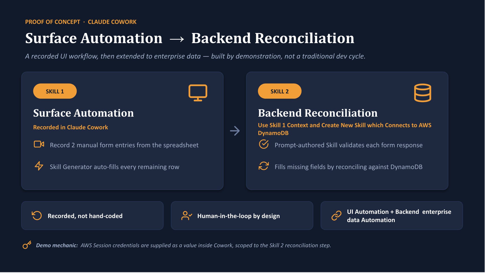
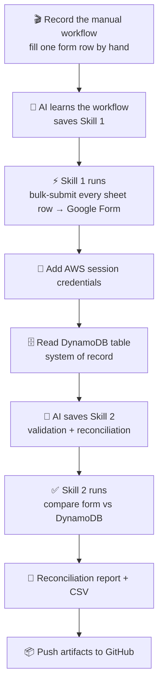

# Lab 2 — Teach an AI Once, Automate Forever
### From a screen recording → two reusable Skills → a validated DynamoDB reconciliation



> **The one-line story:** We recorded ourselves doing a boring data-entry task *one time*.
> The AI watched, turned it into a reusable Skill, ran it across every row, then built a
> *second* Skill that checks the results against a database and hands back a clean report —
> all without us writing the automation by hand.

This README is a **step-by-step story** you can follow to reproduce the entire exercise.
Each step lists exactly **what happened** and **which tools did the work**.

---

## What we built

Two Cowork Skills that chain together:

1. **`event-registration-form-fill`** — reads rows from a Google Sheet and submits each one
   into a Google Form (as individual responses), using the fast programmatic path instead
   of clicking through the UI.
2. **`form-dynamodb-reconciliation`** — validates every submitted response and cross-checks
   it against an AWS DynamoDB table (the *system of record*), producing a
   MATCH / MISMATCH / NOT_IN_DDB report and a CSV.

---

## End-to-end flow



---

## The story, step by step

### Step 1 — Record the manual task
We turned on screen recording and filled in the Event Registration **Google Form** by hand for
one or two people, copying values out of the **`event_registration_entries` Google Sheet**
(email, name, phone, food preference, T-shirt size, attendance time) and hitting **Submit**.
That recording became the *teaching example*.

- **Tools:** Desktop **screen recording** (computer-use recorder), Google Chrome, Google Forms, Google Sheets.

### Step 2 — The AI turns the recording into a Skill
Instead of replaying our mouse clicks, the AI identified the *outcome* of each action and wrote
a reusable Skill that submits a row via the Google Forms `formResponse` HTTP endpoint — far
faster and more reliable than UI automation. It discovered the form's field IDs from the form's
embedded config and baked in the sheet→field mapping.

- **Tools:** **Claude in Chrome** (`navigate`, `javascript_tool` to read `FB_PUBLIC_LOAD_DATA_`),
  **Save Skill** (`save_skill`) → produced **`event-registration-form-fill`**.

### Step 3 — Run Skill 1 to fill the whole sheet
With the Skill saved, the AI submitted the remaining rows — one POST per row, validated against
the form's real option strings, one test row first, then the rest. Every submission returned
Google's success confirmation.

- **Tools:** **Claude in Chrome** (`javascript_tool` POST to `formResponse`), **Task list**
  (`TaskCreate` / `TaskUpdate`) for progress tracking.

### Step 4 — Bring in the system of record (AWS)
We pasted short-lived AWS session credentials into the session. The AI wrote them to
`~/.aws/credentials` (never printed or committed) and confirmed identity with a read-only call.

- **Tools:** **Workspace shell** (`bash`) to write the AWS profile, **AWS API MCP**
  (`aws sts get-caller-identity`).

### Step 5 — Inspect the DynamoDB table
The AI scanned the DynamoDB table **`claude-skillrecording-demo`** and listed all items, and
checked the key schema (partition key = `Email`) so lookups would be correct.

- **Tools:** **AWS API MCP** (`aws dynamodb scan`, `aws dynamodb describe-table`).

### Step 6 — Build Skill 2 (validation + reconciliation)
From a detailed spec, the AI authored a second Skill: read submitted responses, validate them,
look each up in DynamoDB by `Email`, compare every mapped field, and classify the result. It's
read-only against DynamoDB, retries with backoff, and never exposes credentials.

- **Tools:** **Save Skill** (`save_skill`) → produced **`form-dynamodb-reconciliation`**.

### Step 7 — Run the reconciliation
The AI executed the Skill: it fetched the DynamoDB data (via the AWS MCP, since the sandbox
blocks direct AWS network calls), validated all responses, compared them field-by-field, and
wrote a report + CSV.

- **Tools:** **Workspace shell** (`bash` + Python) for the comparison engine, **AWS API MCP**
  for the read-only DynamoDB data, **Present Files** to share the CSV.

### Step 8 — Publish the artifacts
Finally we staged everything into this `lab2/` folder (scanned to guarantee no secrets) and
copied it into the local clone of this GitHub repo, ready to commit and push.

- **Tools:** **Workspace shell** (`bash`), **Git** (local), GitHub.

---

## Tools used — quick reference

| Category            | Tool                              | Used for |
|---------------------|-----------------------------------|----------|
| Recording           | Computer-use screen recorder      | Capturing the manual demo |
| Browser automation  | Claude in Chrome                  | Reading form config, submitting responses |
| Skill authoring     | `save_skill`                      | Saving both reusable Skills |
| Cloud (read-only)   | AWS API MCP                       | STS identity, DynamoDB scan/describe |
| Compute             | Workspace shell (`bash` + Python) | AWS profile, reconciliation engine |
| Data sources        | Google Sheets, Google Forms       | Source data + submission target |
| Database            | Amazon DynamoDB                   | System of record |
| Progress + delivery | Task list, Present Files, Git     | Tracking, sharing, publishing |

---

## Reproduce it yourself

**Prerequisites**
- Cowork (Claude desktop) with **Claude in Chrome** and the **AWS API MCP** available.
- A Google Sheet of registrants and a Google Form with matching fields.
- A DynamoDB table keyed by your match field (here: `Email`), plus short-lived AWS creds
  with **read-only** access to it.

**Do this**
1. Record yourself filling the form once from the sheet.
2. Ask Cowork to turn the recording into a Skill → you get a form-fill Skill.
3. Ask it to run the Skill on the remaining rows (confirm which rows first).
4. Provide AWS session credentials; verify with `aws sts get-caller-identity`.
5. Ask it to scan your DynamoDB table and confirm the key schema.
6. Ask it to create the reconciliation Skill (share the field mapping + statuses you want).
7. Run the reconciliation → review `Reconciliation_Results.csv`.
8. Commit the artifacts to your repo.

**Run the reconciliation script directly**
```bash
cd lab2/reconciliation
python3 reconcile.py     # reads form_responses.json + ddb_items.json → Reconciliation_Results.csv
```

---

## Results from our run

- **11** form responses vs **23** DynamoDB items → **88** field comparisons
- **72 MATCH**, **0 MISMATCH**, **0 validation failures**, **16 NOT_IN_DDB**
- **2** responses needed attention (present in the form, absent from DynamoDB):
  `vikram.gupta5@email.com`, `anjali.reddy6@email.com`

---

## Safety notes

- All emails/phone numbers here are **dummy test data**.
- **No AWS keys, session tokens, or other secrets** are stored in this repo — credentials live
  only in the session and are never printed, logged, or committed.
- DynamoDB access is strictly **read-only**; the reconciliation never writes to the table.

---

## Files in this lab

```
lab2/
├── README.md                                     ← you are here
├── skills/
│   ├── event-registration-form-fill/SKILL.md     ← Skill 1
│   └── form-dynamodb-reconciliation/SKILL.md      ← Skill 2
└── reconciliation/
    ├── reconcile.py                # reconciliation engine (read-only)
    ├── form_responses.json         # submitted responses (test data)
    ├── ddb_items.json              # DynamoDB snapshot (test data)
    └── Reconciliation_Results.csv  # output report
```
