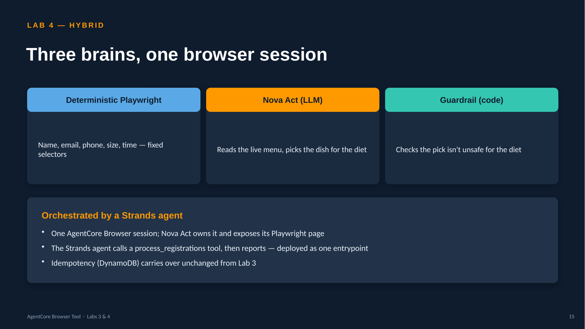

# Lab 4 — Hybrid fill: deterministic Playwright + Nova Act (LLM)

The form gained a new **Food Option** question — *Chicken Pizza · Veg Pasta · Mediterranean
Quinoa Salad · Tofu Scramble Burrito*. There is **no sheet column** for it: the right dish
has to be *reasoned* from each attendee's dietary **preference**. Lab 3's deterministic
Playwright can't do that (and would just skip the unknown field). Lab 4 keeps the
deterministic fill for everything it already nails and adds **Amazon Nova Act** — an LLM —
for the one field that needs judgment, wrapped in a **deterministic safety guardrail**.

Same **AgentCore Browser** as Lab 3; the only change is the *driver* for one question.



> 📊 A full **45-minute session deck** for Labs 3 & 4 lives here: [`AgentCore-Browser-Tool-Session.pptx`](./AgentCore-Browser-Tool-Session.pptx). A detailed presenter walkthrough is in [`workflow_info.md`](./workflow_info.md).

---

## The split (why hybrid)

| Field(s) | Filled by | Why |
|----------|-----------|-----|
| Email, First/Last, Email ID, Phone, Preferred Food, T-Shirt Size, Attendance Time | **Deterministic Playwright** (fixed selectors) | known, stable, cheap, reproducible |
| **Food Option** | **Nova Act** (`nova.act(...)`) | no sheet column — must reason the dish from the diet; menu can change without code |
| Nova Act's pick | **Deterministic guardrail** | safety floor: a vegan must never get Chicken Pizza |

Reserve the LLM for the one field that genuinely needs it. Nova Act is ~90% reliable and
costs a model call per step, so you'd never use it for fields deterministic code handles.

---

## How the Food Option is chosen

Nova Act reads the live options and picks the best fit for the attendee's `Preferred Food`:

| Preferred Food | Nova Act picks | Guardrail rule |
|----------------|----------------|----------------|
| Non-Vegetarian | Chicken Pizza | anything allowed |
| Vegetarian | Veg Pasta | no meat |
| Vegan | Tofu Scramble Burrito | no meat/dairy/egg |
| Gluten-Free | Mediterranean Quinoa Salad | no gluten |

The guardrail (`menu_picker.guardrail_ok`) does **not** hardcode the exact pick — it tags
each dish with dietary attributes and checks the LLM's pick against the preference's
forbidden set. It's a demonstration of "LLM makes the judgment, code checks the floor," and
it's **optional** via the `GUARDRAIL` env var:

| `GUARDRAIL` | Behavior |
|-------------|----------|
| `off` (default) | trust Nova Act's pick; submit it |
| `warn` | submit, but annotate the row if the pick looks unsafe |
| `strict` | block the row if the pick violates the preference (retries next run) |

Real example the guardrail caught in `strict` mode: for a **Gluten-Free** attendee, Nova Act
picked *"Tofu Scramble Burrito"* reasoning it's gluten-free — but a burrito's tortilla is
wheat, so `strict` blocked it (the truly GF option was Mediterranean Quinoa Salad). Great to
show *why* a safety net matters; off by default so it doesn't get in the way.

---

## Flow (per row)

```
reserve(form, email)  ── DynamoDB, skip if already submitted
  └─ new →  _fill_known(page, row)          deterministic Playwright (all but Food Option)
            pick_menu(nova, page, pref):     Nova Act
                nova.act("pick the item for a <pref> diet, options only")
                read back the selected radio
                guardrail_ok(pref, pick)?  ── unsafe → raise → row fails (no submit)
            click_submit(page); is_confirmed(page)
```

Nova Act **owns the AgentCore Browser session**; `nova.page` is the Playwright page used
for the deterministic fields, and `nova.act()` drives the Food Option. One browser, one
session recording.

---

## Files (delta from Lab 3)

| File | Change |
|------|--------|
| `app.py` | **unified entrypoint** — Strands agent + deterministic modes over one hybrid pipeline (replaces `runtime_handler.py` + the ADK `agent.py`) |
| `menu_picker.py` | **new** — Nova Act pick + dietary guardrail |
| `form_filler.py` | drives the browser via `NovaAct`; `_fill_known` (deterministic) + menu step |
| `requirements.txt` | adds `nova-act` + `strands-agents` |
| `deploy/iam_runtime_policy.json` | adds `bedrock:InvokeModel` (Nova Act + Strands model) |

Everything else (params, sheet_reader, idempotency, Dockerfile, Makefile, deploy/, events/)
is Lab 3 unchanged, renamed to `lab4_*`.

---

## One unified entrypoint (`app.py`), two modes

Deploy **one file** — `app.py`. It picks a mode per invocation from the payload (no
redeploy to switch):

| `"mode"` | What runs | When |
|----------|-----------|------|
| `agent` (default) | a **Strands agent** orchestrates the run (tool: `process_registrations`) and returns a written report | when you want reasoned reporting / triage |
| `deterministic` | the pipeline runs directly, no LLM in control flow | the cheapest, fully reproducible daily job |

```bash
make deploy                                   # entrypoint app.py
make invoke                                   # agent mode (payload default)
# deterministic run: add "mode": "deterministic" to events/payload.example.json
```

Both modes call the *same* hybrid `fill_form` underneath (deterministic Playwright + Nova
Act menu + guardrail + idempotency). Agent mode adds **one** Bedrock reasoning call per run
(not per row), so it stays cheap. Override the default with the `MODE` env var or per
payload; set the Strands model via `MODEL_ID`.

## Nova Act authentication (local key, runtime IAM)

Nova Act has two auth paths; `fill_form` auto-selects based on whether `NOVA_ACT_API_KEY`
is set:

| Where | Auth | Setup |
|-------|------|-------|
| **Local** (`make run-local` / `make browser-test`) | **API key** | `export NOVA_ACT_API_KEY=<key>` (get one at [nova.amazon.com/act](https://nova.amazon.com/act) → dev tools) |
| **Deployed runtime** | **AWS IAM** via Nova Act's `@workflow` | one-time `make nova-workflow` (creates the workflow definition); the runtime role's `nova-act:*` + `bedrock:InvokeModel` cover the rest |

So: set the key for local dev, and the deployed runtime uses IAM automatically (no key in the
container). `make doctor` tells you which mode you're in. Override the workflow name/model
with `NOVA_ACT_WORKFLOW` / `NOVA_ACT_MODEL`.

> The AWS Service path may also need an S3 bucket + role for run exports depending on your
> account — see `deploy/create_nova_workflow.sh`. Tighten `nova-act:*` in
> `iam_runtime_policy.json` to the specific actions your security posture requires.

## Run it / ship it

Same targets as Lab 3 (account auto-detected, python3.12 venv). See
[`../ImplementationPlan.md`](../ImplementationPlan.md) for the full walkthrough — it applies
here with `lab4_*` names.

```bash
cd lab4
make whoami · make install · make doctor
make dedup-table
make browser-test          # one row incl. the Nova Act menu pick
make run-local LIMIT=2
make deploy · make runtime-policy · make invoke
make deploy-lambda · make schedule TIMEZONE=Asia/Kolkata
```

**Nova Act prerequisites:** the runtime role needs Bedrock model access (added in
`iam_runtime_policy.json` and applied by `make runtime-policy`). Depending on your
`nova-act` version you may also need a `NOVA_ACT_API_KEY` or Bedrock model enablement —
confirm the `NovaAct(...)` constructor args (`cdp_endpoint_url` / `cdp_headers`) and auth
against your installed SDK; those are the version-sensitive spots.

---

## Determinism note

Lab 4 is deterministic **except** the single Food Option field, and even that is bounded by
a deterministic guardrail. So the audit story stays strong: one LLM call per row for one
field, a recorded browser session, and a hard safety check on the model's output. That's
the closing lesson of the series — **LLM for judgment, deterministic code for the safety
net.**
